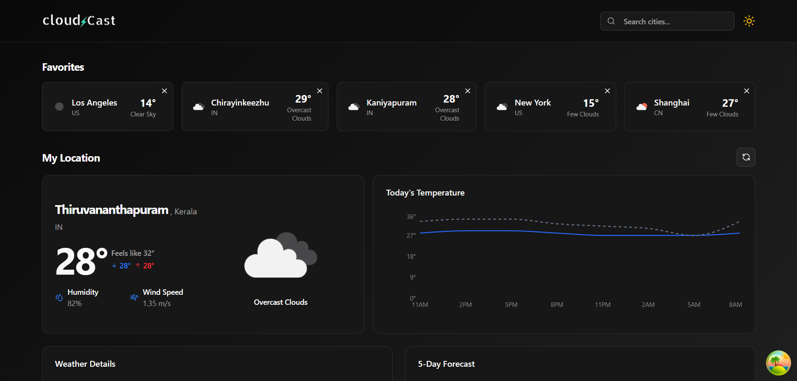

# ☁️ Cloud Cast

**Cloud Cast** is a sleek weather web app built with React and [ShadCN UI](https://ui.shadcn.com). It provides real-time weather updates, 5-day forecasts, and a smooth user experience with light and dark mode support.

---

## 🌟 Features

- 🔍 **Search Cities** — Instantly find weather data by city
- 📍 **My Location Weather** — Auto-detect and show local weather
- ⭐ **Favorite Cities** — Save and manage your favorite locations
- 🌦️ **Weather Details** — Temp, humidity, wind speed, description, icons
- 📈 **Temperature Chart** — Hourly temperature trends visualized
- 🌓 **Dark/Light Mode** — Toggle themes with smooth transitions
- ⚡ **Responsive UI** — Built with Tailwind CSS and ShadCN UI components

---

## 🛠️ Tech Stack

- **React** (with Vite)
- **ShadCN UI** + **Tailwind CSS**
- **React Query (TanStack Query)** for data fetching and caching
- **React Router DOM** for client-side routing
- **OpenWeatherMap API** for weather data
- **Lucide React Icons**
- **Local Storage** for favorite city persistence

---

## 🔧 Setup Overview

- Weather data from: [OpenWeatherMap API](https://openweathermap.org/api)
- Favorite cities stored in local storage
- Theme managed via a custom context (`useTheme`)
- Clean, modern UI powered by **ShadCN UI**

---

## 🖼️ UI Preview

---

